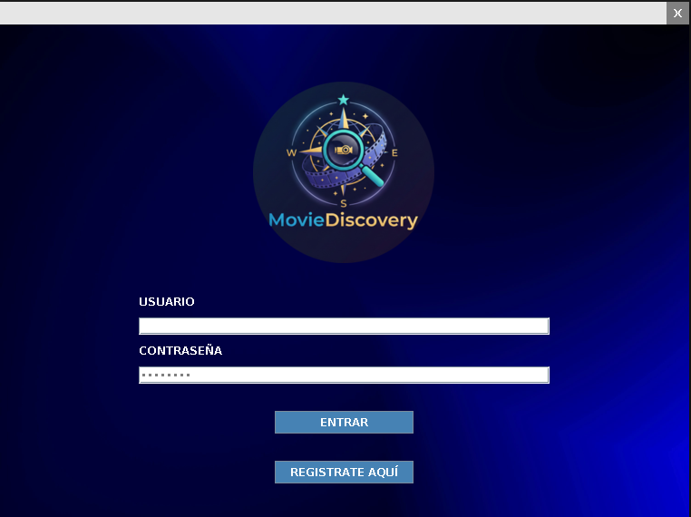
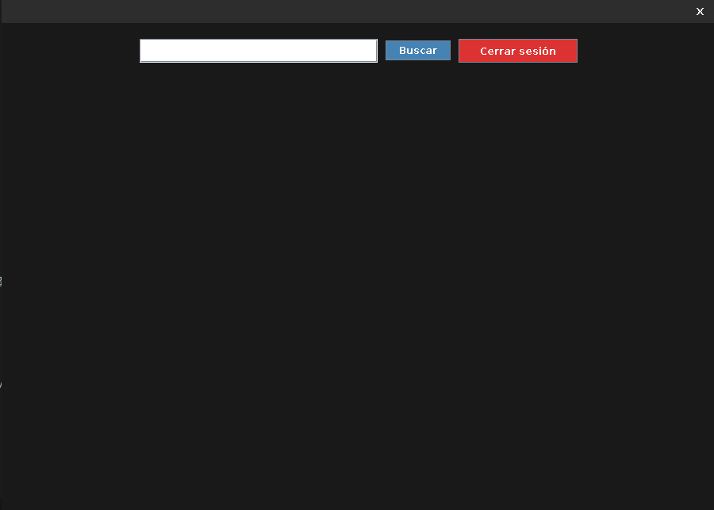
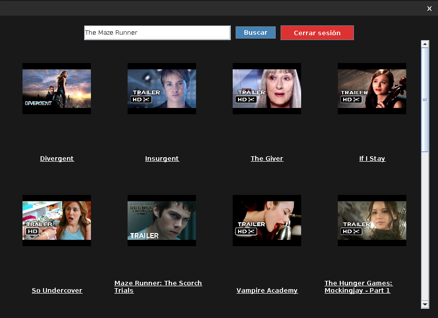

# Movie Discovery

[](https://www.java.com/)
[](https://maven.apache.org/)
[](https://www.docker.com/)
[]()
[](LICENSE)

---

## 📋 Descripción

Movie Discovery es una aplicación de descubrimiento de películas que utiliza recomendaciones personalizadas basadas en la API de TasteDive. El sistema combina un backend robusto con Kafka para procesamiento asincrónico y un frontend de escritorio intuitivo, completamente dockerizado.

---

## 🛠️ Tecnologías

| Categoría | Tecnologías |
|-----------|-------------|
| **Backend** | Java, Maven, Servlet, Kafka |
| **Frontend** | Java Swing |
| **Base de Datos** | PostgreSQL |
| **Integración** | TasteDive API |
| **Containerización** | Docker, Docker Compose |
| **Mensajería** | Apache Kafka |

---

## ✨ Características Principales

- 🔐 **Autenticación segura** con gestión de sesiones
- 🎬 **Búsqueda de películas** mediante integración con TasteDive API
- 🤖 **Recomendaciones personalizadas** basadas en preferencias
- ⚡ **Procesamiento asincrónico** con Apache Kafka
- 💾 **Caché de imágenes** para optimización de rendimiento
- 🎨 **Interfaz gráfica intuitiva** con Java Swing
- 🐳 **Despliegue completamente containerizado** con Docker Compose

---

## 📂 Estructura del Proyecto

```
Movie-Discovery/
├── backend/
│   ├── src/main/java/com/tastedivekafka/
│   │   ├── api/              # Servlets y clientes API
│   │   ├── config/           # Configuración de la aplicación
│   │   ├── db/               # DAOs y conexión BD
│   │   └── kafka/            # Servicios Kafka
│   ├── src/main/resources/   # Archivos de configuración
│   ├── Dockerfile            # Containerización backend
│   └── pom.xml              # Dependencias Maven
├── frontend/
│   ├── src/main/java/com/tastedivekafka/
│   │   ├── session/          # Gestión de sesiones
│   │   └── ui/               # Componentes de interfaz
│   ├── Dockerfile            # Containerización frontend
│   └── pom.xml              # Dependencias Maven
├── db/
│   └── init.sql             # Scripts de inicialización BD
├── docker-compose.yml        # Configuración Docker Compose
├── .gitignore               # Configuración Git
└── README.md                # Este archivo
```

---

## 🚀 Instalación

### Requisitos Previos

- **Docker y Docker Compose**
- **Git**

Opcionalmente, para desarrollo local:
- **Java 17+**
- **Maven 3.8+**
- **PostgreSQL 13+**
- **Apache Kafka**

### Paso 1: Clonar el repositorio

```bash
git clone https://github.com/sargon494/Movie-Discovery.git
cd Movie-Discovery
```

### Paso 2: Configurar variables de entorno

Crear archivo `.env`:

```env
# Database
DB_USER=postgres
DB_PASSWORD=your_password
DB_NAME=movie_discovery

# Kafka
KAFKA_BOOTSTRAP_SERVERS=kafka:9092

# API
TASTDIVE_API_KEY=your_api_key
```

### Paso 3: Ejecutar con Docker Compose

```bash
docker-compose up -d
```

Backend disponible en: `http://localhost:8090`

---

## ⚙️ Configuración

### Variables de Entorno

| Variable | Descripción | Tipo |
|----------|-------------|------|
| `DB_USER` | Usuario de PostgreSQL | String |
| `DB_PASSWORD` | Contraseña de BD | String |
| `DB_NAME` | Nombre de la base de datos | String |
| `KAFKA_BOOTSTRAP_SERVERS` | Brokers de Kafka | String |
| `TASTDIVE_API_KEY` | API Key de TasteDive | String |

### Base de Datos

El schema se crea automáticamente al levantar Docker Compose.

Tablas principales:
- `users` - Gestión de usuarios
- `movies` - Catálogo de películas
- `recommendations` - Recomendaciones personalizadas

---

## 💻 Uso

### Con Docker Compose (Recomendado)

```bash
docker-compose up -d
```

Todos los servicios se ejecutarán automáticamente: PostgreSQL, Kafka, Backend y Frontend.

### Desarrollo Local

#### Backend

```bash
cd backend
mvn clean package
mvn spring-boot:run
```

#### Frontend

```bash
cd frontend
mvn clean package
mvn exec:java -Dexec.mainClass="com.tastedivekafka.FrontendApp"
```

### API Endpoints

| Método | Endpoint | Descripción |
|--------|----------|-------------|
| POST | `/api/auth/login` | Autenticación de usuario |
| POST | `/api/auth/register` | Registro de usuario |
| GET | `/api/search?q=term` | Búsqueda de películas |
| GET | `/api/recommendations` | Obtener recomendaciones |

---

## 👥 Roles de Usuario

- **Usuario Regular**: Acceso a búsqueda, recomendaciones personalizadas
- **Administrador**: Gestión completa de usuarios y contenido

---

## 🔄 Flujo de Procesamiento

1. Usuario realiza búsqueda desde el frontend
2. Request se envía al backend
3. Backend procesa y publica evento en Kafka
4. Consumer de Kafka procesa en background
5. Resultados se almacenan en PostgreSQL
6. Frontend recibe recomendaciones personalizadas

---

## 🚧 Mejoras Futuras

- [ ] Aplicación móvil (Android/iOS)
- [ ] Sistema de valoraciones y reseñas
- [ ] Integración con múltiples APIs de películas
- [ ] Dashboards analíticos avanzados
- [ ] Exportación de listas de películas

---


## 📸 Screenshots






---

## 📝 Licencia

Este proyecto está bajo la licencia **MIT**. Ver archivo [LICENSE](LICENSE) para más detalles.

---

## 👨‍💻 Autor

**Sargon494**

- GitHub: [@sargon494](https://github.com/sargon494)

---

**Última actualización**: 2026 | **Versión**: 1.0.0-beta

🎬 MovieDiscovery

📌 Descripción

MovieDiscovery es una aplicación de escritorio desarrollada en Java que permite descubrir películas similares a partir de una búsqueda del usuario. El sistema utiliza una arquitectura orientada a eventos basada en Apache Kafka, integrando una API externa (TasteDive) y una base de datos PostgreSQL para ofrecer recomendaciones de forma asíncrona, escalable y desacoplada.

El proyecto ha sido diseñado específicamente como proyecto de portfolio, demostrando buenas prácticas de arquitectura, separación de responsabilidades y uso de tecnologías utilizadas en entornos reales.

🧠 Arquitectura General

MovieDiscovery sigue una arquitectura event-driven basada en productores y consumidores Kafka.

Flujo principal:

1. El usuario inicia sesión en la aplicación

2. Introduce el nombre de una película

3. La UI envía la petición a Kafka

4. Un backend consume la petición y procesa la lógica

5. Se consulta la API de TasteDive

6. Se guardan los datos en PostgreSQL

7. Se envían las recomendaciones de vuelta a Kafka

8. La UI recibe las respuestas y actualiza la vista

Diagrama lógico simplificado:

[UI Swing]
│
│ produce (movie-topic)
▼
[Kafka Backend Consumer]
│
├──► TasteDive API
│
├──► PostgreSQL
│
└──► produce (movie-responses)
│
▼
[UI Response Consumer]

⚙️ Tecnologías Utilizadas

Java 17

Apache Kafka (mensajería asíncrona)

Docker & Docker Compose

Kafka

Zookeeper

PostgreSQL

PostgreSQL (persistencia de datos)

Swing (interfaz gráfica)

TasteDive API (recomendaciones de películas)

Apache NetBeans (desarrollo Java)

Visual Studio Code (gestión del proyecto y Docker)

GitHub Projects

🧩 Componentes Principales
🔌 Kafka
KafkaProducerService

Envía las búsquedas de películas al topic movie-topic

Desacopla completamente la UI del backend

KafkaConsumerService (Backend)

Consume peticiones de búsqueda

Llama a la API de TasteDive

Procesa y valida la respuesta

Guarda datos en PostgreSQL

Publica resultados en movie-responses

Gestiona errores mediante movie-errors

✔ Commit manual de offsets ✔ Shutdown limpio con wakeup()

KafkaResponseConsumerService

Escucha respuestas del backend

Notifica a la UI mediante callbacks

Usa un Group ID dinámico para recibir siempre mensajes nuevos

🗄️ Base de Datos (PostgreSQL)
DBConnection

Centraliza la conexión JDBC a PostgreSQL

Pensado para ejecutarse dentro de contenedores Docker

MovieDAO

Gestiona la tabla movies

Inserta o recupera películas evitando duplicados

Seguro ante concurrencia (ON CONFLICT)

RecommendationDAO

Gestiona las recomendaciones asociadas a películas

Permite guardar y recuperar recomendaciones

UserDAO

Gestiona la autenticación de usuarios

Comprueba credenciales contra la base de datos

⚠️ En esta versión, las contraseñas se almacenan en texto plano (mejora futura)

🌐 API Externa
TasteDiveClient

Encapsula las llamadas HTTP a la API de TasteDive

Codifica parámetros de forma segura

Devuelve la respuesta en formato JSON

Aísla completamente la dependencia externa

🖥️ Interfaz Gráfica (Swing)
LoginFrame

Pantalla de autenticación

UI personalizada

Comunicación desacoplada mediante listeners

MainFrame

Pantalla principal de búsqueda

Envía peticiones a Kafka

Escucha respuestas de forma asíncrona

Muestra las recomendaciones en formato de tarjetas

Carga imágenes en segundo plano para no bloquear la UI

🚀 Ejecución del Proyecto

Levantar los contenedores Docker:

docker-compose up -d

Asegurarse de que Kafka, Zookeeper y PostgreSQL están activos

Ejecutar la aplicación Java desde NetBeans o línea de comandos

🔮 Posibles Mejoras Futuras

Respuestas Kafka en formato JSON (Jackson / Gson)

Hash de contraseñas (BCrypt)

Historial de búsquedas por usuario

Caché de resultados en base de datos

Microservicio backend independiente

Tests unitarios e integración

Dockerización completa de la aplicación Java
