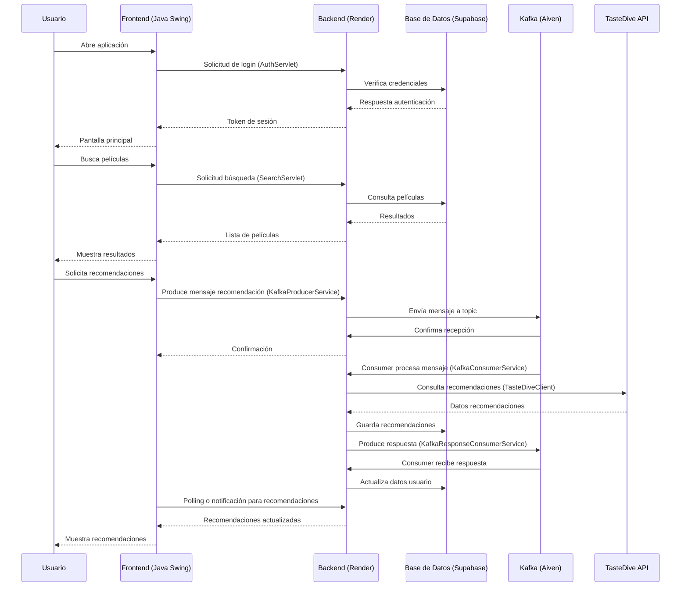

# Movie Discovery

[](https://www.java.com/)
[](https://maven.apache.org/)
[](https://www.docker.com/)
[](https://render.com/)
[](https://supabase.com/)
[](https://aiven.io/)
[]()
[](LICENSE)

---

## 📋 Descripción

Movie Discovery es una aplicación de descubrimiento de películas que utiliza recomendaciones personalizadas basadas en la API de TasteDive. El backend está desplegado en **Render**, la base de datos en **Supabase**, y la mensajería mediante **Apache Kafka en Aiven** para procesamiento asincrónico. El frontend es un cliente de escritorio intuitivo desarrollado con Java Swing.

---

## 🛠️ Tecnologías

| Categoría | Tecnologías |
|-----------|-------------|
| **Backend** | Java 17, Maven, Jakarta Servlet, Apache Kafka |
| **Frontend** | Java Swing |
| **Base de Datos** | PostgreSQL (Supabase) |
| **Mensajería** | Apache Kafka (Aiven) |
| **API Externa** | TasteDive para recomendaciones |
| **Despliegue** | Render (backend), Docker, Docker Compose |
| **Desarrollo** | Apache NetBeans, VS Code |

---

## ✨ Características Principales

- 🔐 **Autenticación segura** con registro, login y verificación por email
- 🎬 **Búsqueda de películas** mediante integración con TasteDive API
- 🤖 **Recomendaciones personalizadas** basadas en preferencias del usuario
- ⭐ **Sistema de valoraciones** de películas vistas (1-5 estrellas)
- 📝 **Historial de búsquedas** y películas visualizadas
- 👤 **Gestión de perfil** con cambio de username y contraseña
- 💾 **Caché de imágenes** para optimización de rendimiento
- ⚡ **Procesamiento asincrónico** con Apache Kafka (Aiven)
- 🎨 **Interfaz gráfica intuitiva** con Java Swing y tema oscuro personalizado
- 🎥 **Reproductor de trailers** integrado
- 🐳 **Despliegue en la nube** con Render, Supabase y Aiven

---

## 📂 Estructura del Proyecto

```
Movie-Discovery/
├── backend/
│   ├── src/main/java/com/tastedivekafka/
│   │   ├── api/              # Servlets y clientes API
│   │   ├── config/           # Configuración de la aplicación
│   │   ├── db/               # DAOs y conexión BD
│   │   └── kafka/            # Servicios Kafka
│   ├── src/main/resources/   # Archivos de configuración
│   ├── Dockerfile            # Containerización backend
│   └── pom.xml              # Dependencias Maven
├── frontend/
│   ├── src/main/java/com/tastedivekafka/
│   │   ├── session/          # Gestión de sesiones
│   │   └── ui/               # Componentes de interfaz
│   ├── Dockerfile            # Containerización frontend
│   └── pom.xml              # Dependencias Maven
├── db/
│   └── init.sql             # Scripts de inicialización BD
├── docker-compose.yml        # Configuración Docker Compose
├── .gitignore               # Configuración Git
└── README.md                # Este archivo
```

---

## 🏗️ Arquitectura del Sistema

### Diagrama de Secuencia



### Infraestructura en Producción

- **Backend**: Desplegado en [Render](https://render.com/) como servicio web
- **Base de Datos**: PostgreSQL gestionado por [Supabase](https://supabase.com/)
- **Mensajería**: Apache Kafka proporcionado por [Aiven](https://aiven.io/)
- **API Externa**: [TasteDive](https://tastedive.com/) para recomendaciones de películas

---

## 🚀 Instalación y Despliegue

### Opción 1: Ejecutar Frontend (Despliegue en Producción)

El backend está ya desplegado en Render. Solo necesitas ejecutar el frontend localmente:

#### Requisitos
- Java 17+
- Maven 3.8+

#### Pasos
1. Clona el repositorio:
   ```bash
   git clone https://github.com/sargon494/Movie-Discovery.git
   cd Movie-Discovery
   ```

2. Compila y ejecuta el frontend:
   ```bash
   cd frontend
   mvn clean compile exec:java -Dexec.mainClass="com.tastedivekafka.FrontendApp"
   ```

### Opción 2: Desarrollo Local con Docker Compose

#### Requisitos
- Docker y Docker Compose
- Git

#### Pasos
1. Clona el repositorio:
   ```bash
   git clone https://github.com/sargon494/Movie-Discovery.git
   cd Movie-Discovery
   ```

2. Crea el archivo `.env` en la raíz del proyecto:
   ```env
   # Database (Supabase)
   DB_USER=postgres
   DB_PASSWORD=your_supabase_password
   DB_NAME=postgres
   DB_HOST=your-supabase-host.supabase.co
   
   # Kafka (Aiven)
   KAFKA_BOOTSTRAP_SERVERS=your-kafka-aiven:9092
   
   # API Keys
   TASTEDIVE_API_KEY=your_tastedive_api_key
   ```

3. Levanta los contenedores:
   ```bash
   docker-compose up -d
   ```

4. El backend estará disponible en `http://localhost:8090`

---

## ⚙️ Configuración

### Variables de Entorno

| Variable | Descripción | Servicio | Ejemplo |
|----------|-------------|----------|----------|
| `DB_USER` | Usuario de PostgreSQL | Supabase | `postgres` |
| `DB_PASSWORD` | Contraseña de BD | Supabase | `your_password` |
| `DB_NAME` | Nombre de la base de datos | Supabase | `postgres` |
| `DB_HOST` | Host de la BD | Supabase | `your-project.supabase.co` |
| `KAFKA_BOOTSTRAP_SERVERS` | Brokers de Kafka | Aiven | `broker1:9092,broker2:9092` |
| `TASTEDIVE_API_KEY` | API Key de TasteDive | TasteDive | `your_tastedive_key` |

### Base de Datos (Supabase)

Esquema principal:
- `users` - Gestión de usuarios (username, email, password, created_at, verified)
- `movies` - Catálogo de películas (título, imagen, trailers)
- `recommendations` - Recomendaciones personalizadas
- `user_viewed` - Películas vistas con valoraciones (rating 1-5)
- `search_history` - Historial de búsquedas por usuario

---

## 💻 Uso

### Funcionalidades Principales

1. **Registro e Identificación**
   - Registro con username, email y contraseña
   - Verificación de email obligatoria
   - Login con username o email
   - Gestión de contraseña

2. **Búsqueda de Películas**
   - Búsqueda por título
   - Resultados desde TasteDive API
   - Visualización de trailers integrado
   - Historial automático de búsquedas

3. **Recomendaciones**
   - Procesamiento asincrónico vía Kafka
   - Recomendaciones personalizadas
   - Resultados cacheados en Supabase

4. **Valoraciones**
   - Sistema de estrellas (1-5) para películas vistas
   - Actualización de valoraciones en tiempo real
   - Historial de películas visualizadas

5. **Perfil de Usuario**
   - Ver información del perfil
   - Cambiar username
   - Cambiar contraseña
   - Eliminar cuenta
   - Ver historial completo

### API Endpoints (Backend en Render)

| Método | Endpoint | Descripción | Auth |
|--------|----------|-------------|------|
| POST | `/auth/login` | Login con identifier:password | ✅ |
| POST | `/auth/register` | Registro usuario:email:password | ✅ |
| POST | `/auth/verify` | Verificación de email | ✅ |
| GET | `/search?q=term` | Búsqueda de películas | ✅ |
| POST | `/search` | Grabar búsqueda en Kafka | ✅ |
| GET | `/profile` | Información del perfil | ✅ |
| PUT | `/profile/username` | Cambiar username | ✅ |
| PUT | `/profile/password` | Cambiar contraseña | ✅ |
| DELETE | `/profile` | Eliminar cuenta | ✅ |
| GET | `/viewed` | Películas vistas con rating | ✅ |
| POST | `/viewed` | Agregar película vista | ✅ |
| PUT | `/viewed` | Actualizar valoración | ✅ |
| DELETE | `/viewed` | Eliminar película vista | ✅ |
| GET | `/history` | Historial de búsquedas | ✅ |
| POST | `/history` | Grabar búsqueda en historial | ✅ |

---

## 👥 Roles de Usuario

- **Usuario Regular**: Acceso a búsqueda, recomendaciones personalizadas y valoraciones
- **Usuario Verificado**: Acceso a historial y perfil

---

## 🔄 Flujo de Procesamiento

1. **Autenticación**: Usuario se registra/verifica vía email en Supabase
2. **Búsqueda**: Frontend envía consulta al backend en Render
3. **Procesamiento**: Backend publica evento en Kafka (Aiven) de forma asincrónica
4. **Recomendaciones**: Consumer de Kafka procesa y consulta TasteDive API
5. **Almacenamiento**: Resultados se guardan en Supabase
6. **Respuesta**: Datos se envían de vuelta vía Kafka
7. **Visualización**: Frontend muestra recomendaciones actualizadas con caché de imágenes

---

## 🚧 Mejoras Futuras

- [ ] Aplicación móvil (Android/iOS)
- [ ] Sistema de reseñas y comentarios en películas
- [ ] Integración con APIs adicionales (IMDb, TMDB)
- [ ] Dashboards analíticos para usuarios
- [ ] Exportación de listas de películas (PDF, JSON)
- [ ] Recomendaciones basadas en machine learning
- [ ] Sistema de favoritos compartidos
- [ ] Notificaciones push para nuevos estrenos
- [ ] Modo offline con sincronización
- [ ] Autenticación OAuth (Google, GitHub)

---


## 📸 Screenshots


---

## 🔧 Componentes Clave

### Backend (Render)

**Servlets:**
- `AuthServlet` - Autenticación y registro
- `SearchServlet` - Búsqueda de películas
- `ProfileServlet` - Gestión de perfil
- `ViewedServlet` - Películas vistas y valoraciones
- `HistoryServlet` - Historial de búsquedas
- `VerificationServlet` - Verificación de email
- `EmailService` - Envío de emails de verificación
- `TasteDiveClient` - Cliente HTTP para TasteDive API

**Kafka (Aiven):**
- `KafkaProducerService` - Publica eventos de búsqueda
- `KafkaConsumerService` - Consume búsquedas y genera recomendaciones
- `KafkaResponseConsumerService` - Consume respuestas del backend
- `KafkaConfig` - Configuración de conexión a Aiven

**Base de Datos (Supabase):**
- `UserDAO` - Operaciones CRUD de usuarios
- `MovieDAO` - Gestión de películas
- `RecommendationDAO` - Gestión de recomendaciones
- `DBConnection` - Conexión JDBC a PostgreSQL

### Frontend (Java Swing)

- `LoginFrame` - Pantalla de login/registro con verificación
- `MainFrame` - Panel principal con búsqueda y resultados
- `ProfileDialog` - Gestión de perfil y valoraciones
- `TrailerBrowser` - Reproductor de trailers integrado
- `BackendClient` - Cliente HTTP para comunicación con backend
- `ImageCache` - Caché de imágenes para optimización
- `DarkScrollBarUI` - Componente personalizado de scrollbar
- `AppSession` - Gestión de sesión del usuario

---

## 📝 Licencia

Este proyecto está bajo la licencia **MIT**. Ver archivo [LICENSE](LICENSE) para más detalles.

---

## 👨‍💻 Autor

**Sargon494**

- GitHub: [@sargon494](https://github.com/sargon494)
- Portfolio: [Movie Discovery](https://github.com/sargon494/Movie-Discovery)

---

## 🙏 Agradecimientos

- [TasteDive API](https://tastedive.com/) por proporcionar recomendaciones de películas
- [Supabase](https://supabase.com/) por la base de datos PostgreSQL alojada
- [Aiven](https://aiven.io/) por el servicio de Apache Kafka gestionado
- [Render](https://render.com/) por el hosting del backend
- Comunidad de Java por las librerías y herramientas utilizadas

---

**Última actualización**: Marzo 2026 | **Versión**: 1.0.0