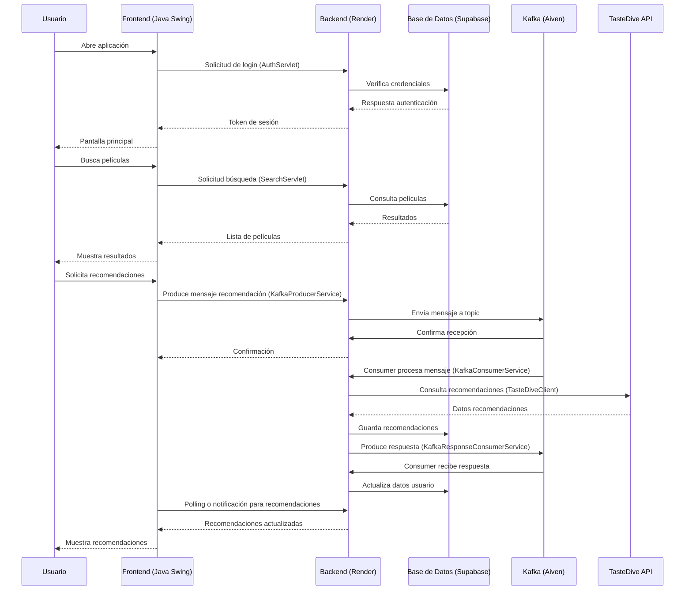

# Arquitectura y Flujo del Sistema Movie-Discovery

## Diagrama de Secuencia

## Descripción del Flujo

1. **Autenticación**: El usuario inicia sesión a través del frontend, que se comunica con el backend en Render. El backend verifica las credenciales en Supabase.

2. **Búsqueda de Películas**: El frontend solicita búsquedas al backend, que consulta la base de datos en Supabase.

3. **Recomendaciones**: Para recomendaciones, el backend usa Kafka en Aiven para procesar mensajes asincrónicamente. Envía consultas a la API de TasteDive y guarda los resultados en Supabase.

4. **Infraestructura**:
   - Backend: Desplegado en Render
   - Base de Datos: Supabase
   - Mensajería: Kafka en Aiven
   - API Externa: TasteDive para recomendaciones

Este diagrama muestra el flujo principal de la aplicación Movie-Discovery.